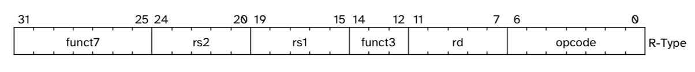
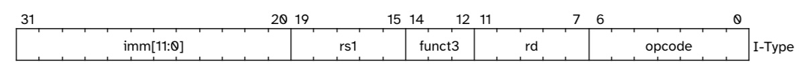
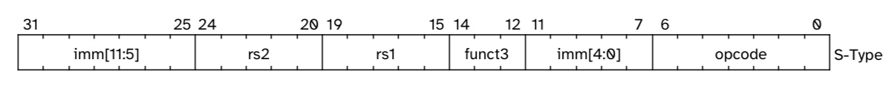
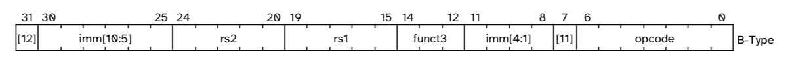
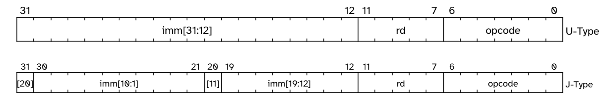

# RV32I Single-cycle processor
## My Goal
- To implement a basic set of Arithmetic, Load/Store, and Branch operations:
	- ALU Operations: `ADD`, `SUB`, `AND`, `OR`, `XOR`
	- Immediate Operations: `ADDI`, `ANDI`, `ORI`, `XORI`
	- Load/Store: `LW`, `SW`
	- Branches: `BEQ`, `J` (Unconditional Branch)
- What I can work with: 32 x `32b` registers, Instruction and Data Memories, a main Control-Unit and other sub-components
- A sample testbench that you can use to evaluate these on your own is provided in [single_cycle_tb.sv](single_cycle_tb.sv)

## The ISA
I shall be using the `R-`, `I-`, `S-`, `B-`, and `J-Type` formats to implement the mentioned instructions.

###  R-Type

- covers `ADD`, `SUB`, `AND`, `OR`, `XOR`

1. `opcode` → `7’b0110011`
2. `funct3` → `000` for ADD/SUB, `111` for AND, `110` for OR, `100`for XOR.
3. `funct7` → distinguishes between ADD/SUB (`0000000` for ADD, `0100000` for SUB).

- Sample Instruction: `add r2, r0, r1`

### I-Type

- covers `ADDI`, `ANDI`, `ORI`, `XORI`, `LW` (`SUBI` is just `ADDI` with a -ve `imm_i`).
- LW format: `mem[R[rs1]+offset] → R[rs2]`

1. `opcode` → `7’b0010011`
2. `funct3` → specifies which immediate operation it is. ADDI: `000`, ANDI: `111`, LW: `010`, XORI: `100`, ORI: `110`

- Sample Instructions: `ori r3, r2, imm_i`, `lw r5, r4, imm_i`. `imm_i` is of size `[11:0]`.

### S-Type

→ covers `SW`. performs `mem[R[rs1] + offset] ← R[rs2]`. The reason that offset isn’t word (`32b`) assigned mandatorily is since the same `opcode` accommodates SH and SB, too (memory is byte-addressable). However, I shall only use `SW`.

1. `opcode` → S-Type → `7’b0100011`
2. `funct3`→ `010` for SW. Other combinations for `SH`, `SB`.

- Sample Instruction: `sw r3, r4, imm_s`. `imm_s` is of size `[11:0]`.

### B-Type

- covers `BEQ`

 1. `opcode` → `7’b1100011`
 2. `funct3` → `000`. Other combinations for the other branc-variants.

- This utilises most of the architecture from the S-Type Instruction. Let the input to the ALU be `in`. In that case, since `opcode[S]` and `opcode[B]` are mutually exclusive,
	1. `in[31:12]` = `instr[31]` → in both cases, `[31]` is the MSB and Sign-bit
	2. `in[11]` = `is_S_type ? instr[31] : instr[7]` → **additional MUX required**
	3. `in[10:5]` = `instr[20:25]`, `in[4:1]` = `instr[11:8]` →  in both cases
	4. `in[0]` = `is_S_type ? instr[7] : 0` →  **additional MUX required**

This gives us `13b`, i.e., $\pm$ 4kB of locations to access. This happens to be the page-size in a standard OS, so the designers decided not to include another Branch (`B2`) for the *RV32I* ISA, separately, in an attempt to use the same core for both the compressed (`16b`) and `32b` ISAs. 
Can it be done, however? Absolutely- [B2 for the RV32I ISA](B2_instr.md)

- Sample Instruction: `beq r5, r5, imm_b`. `imm_b` is of size `[12:1]`, but undergoes an implicit `<<1` for `16b`-alignemnt

### J-Type

- covers `J`. This is actually the instruction format for `JAL` (Jump and Link), but if we set the value of the link-register (`rd`) to `0`, i.e., if the link-register is `r0`, then it would be interpreted as an unconditional-branch by the compiler.
 set the value of `rd` to `6’b0` (`x0`)- interpreted as an unconditional branch

 1. `opcode` → `7’b1101111`
 2. No `funct3`

- The placement of bits, again, was to reuse every possible pre-existing connection:
	1. `imm[20]` = `instr[31]` →  again, MSB → sign-bit
	2. `imm[10:1]` = `instr[30:21]`→ shares that part in common with I-Type’s `imm[11:0]`
	3. `imm[19:12]` = `instr[19:12]` →  shares this in common with U-type’s `imm[31:12]`
	4. `rd (instr[11:7]), opcode[6:0]`→ same for all instructions
	5. `imm[11] = instr[20]` → remaining bit- inserted in the empty slot

This gives us a range of $\pm$ 1MB of locations to access. 

- Sample instruction: `j imm_j`. `imm_j` is of size `[20:1]`, but undergoes an implicit `<<1` for `16b`-alignment

## The Modules
### `design.sv`
This is merely an aggregate of all the modules I've used, and is the only module that EDAPlayground compiled by default, along with `testbench.sv`
### `riscv_pkg.sv`
This contains various `enums` and `types` I have defined for convenience and increased readability throughout the code base. 
### `PC.sv`
This module initialises and updates the `PC` register. It takes in the `imm32` value provided by the `imd_gen.sv` module, and the `PC_sel` control signal, and chooses between branching (`PC + imm32`), and moving on to the next instruction (`PC + 4`).
Updates values at every `posedge clk`.
### `InstrFile.sv`
This module initialises the Instruction Memory with aforementioned instructions, and outputs a `32b` instruction when indexed by `PC`. 
Purely Combinational.
### `Register_File.sv`
This 
