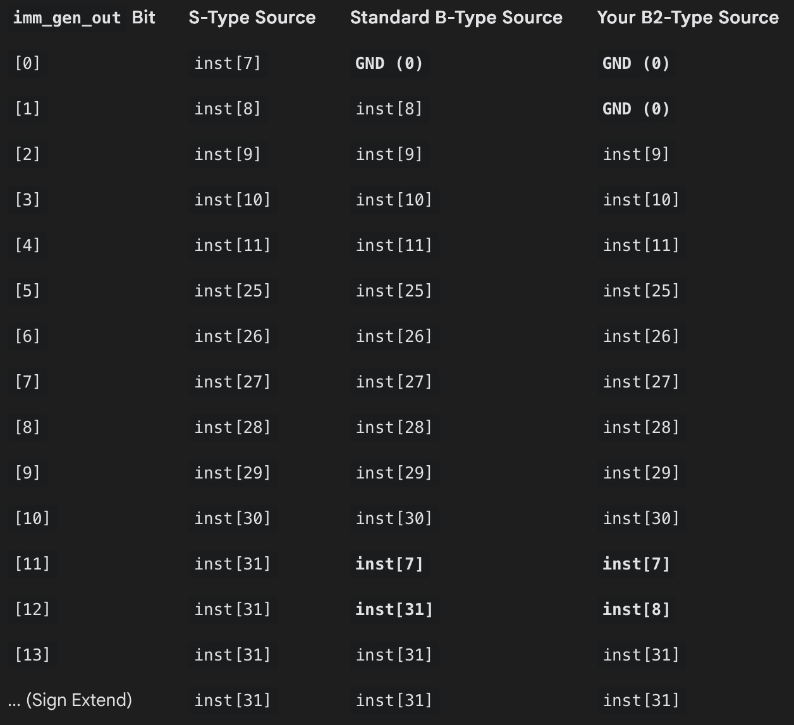

### B2 for the RV32I ISA

Table generated using Google Gemini.

We would need **4 additional MUXes** for `B2`, as compared to **2** in the case of `B` to implement this. This would give an additional $\pm$ 4kB range. 
However, in an attempt to be efficient and simplistic, this wasn’t made mainstream, as it fell into the region of marginal benefits.
